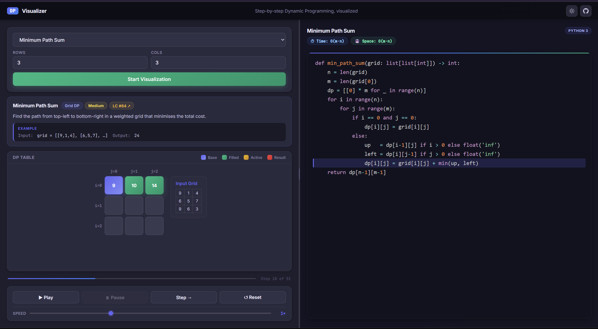
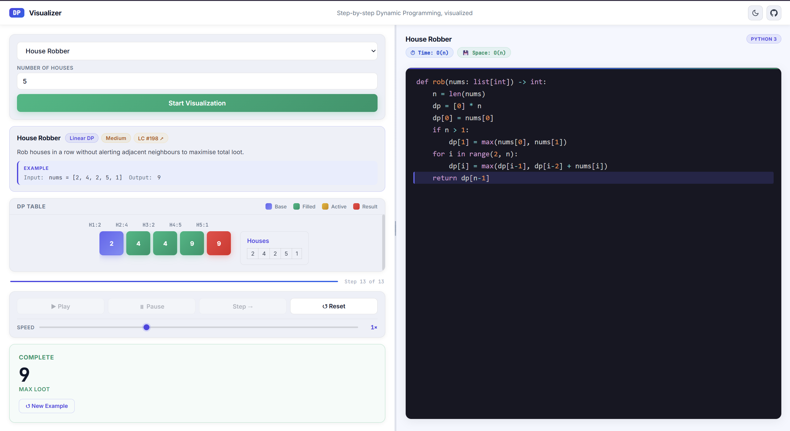
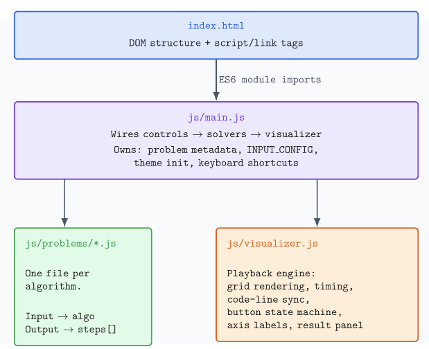

# DP Visualizer

[](https://github.com/Laxmidhar9823/Dynamic-Programming-visualizer/actions/workflows/test.yml)
[](https://github.com/Laxmidhar9823/Dynamic-Programming-visualizer/actions/workflows/deploy.yml)
[](LICENSE)

**Step-by-step Dynamic Programming animations, built with vanilla JavaScript.**

Watch the DP table fill in real time, follow along with synchronized Python 3 code highlighting, and explore nine classic problems — all in a zero-dependency, zero-build-step web app.

### [▶ Live Demo](https://laxmidhar9823.github.io/Dynamic-Programming-visualizer/)

---



<table>
  <tr>
    <td width="50%"></td>
    <td width="50%" valign="middle">
      <strong>Same engine, two themes, nine problems.</strong><br/><br/>
      Every run uses freshly randomized input, every step highlights the matching line of Python, and the entire UI — including the theme — persists across sessions.
    </td>
  </tr>
</table>

---

## Features

- **9 DP problems** spanning four categories — Grid, Linear, String, and Knapsack
- **Step-by-step playback** with Play, Pause, Step, and Reset controls
- **Adjustable speed** via a live slider (0.5× – 2×), takes effect mid-playback
- **Synchronized Python 3 code panel** — the exact line being executed is highlighted as each cell fills
- **Time and space complexity badges** displayed per problem
- **Randomized inputs on every run** — grids, house values, strings, and amounts are freshly generated; the Example panel updates to match
- **↺ New Example button** after completion — reruns with a different random input
- **Light and Dark themes** with automatic persistence via `localStorage`
- **Resizable split pane** — drag the divider to give more space to the grid or the code panel
- **Axis labels** on the DP table (row/column indices, character labels for LCS, weight labels for Knapsack)
- **Keyboard shortcuts**: `Space` play/pause, `→` step, `R` reset, `T` toggle theme
- **Animated cell entry** with staggered transitions when a new grid loads
- **No build step, no dependencies, no installation** — open `index.html` and it runs

---

## Problems Covered

| Problem | Category | Difficulty | LeetCode |
|---|---|---|---|
| Unique Paths | Grid DP | Medium | [#62](https://leetcode.com/problems/unique-paths/) |
| Minimum Path Sum | Grid DP | Medium | [#64](https://leetcode.com/problems/minimum-path-sum/) |
| Maximum Path Sum | Grid DP | Medium | — |
| Climbing Stairs | Linear DP | Easy | [#70](https://leetcode.com/problems/climbing-stairs/) |
| House Robber | Linear DP | Medium | [#198](https://leetcode.com/problems/house-robber/) |
| Longest Common Subsequence | String DP | Medium | [#1143](https://leetcode.com/problems/longest-common-subsequence/) |
| Coin Change | Unbounded Knapsack | Medium | [#322](https://leetcode.com/problems/coin-change/) |
| 0/1 Knapsack | 0/1 Knapsack | Medium | — |
| Partition Equal Subset Sum | 0/1 Knapsack | Medium | [#416](https://leetcode.com/problems/partition-equal-subset-sum/) |

---

## Tech Stack

| | |
|---|---|
| Language | HTML5, CSS3, JavaScript (ES6 modules) |
| Syntax highlighting | [Prism.js](https://prismjs.com/) via CDN |
| Fonts | Inter (UI), JetBrains Mono (code) via Google Fonts |
| Build tooling | None |

---

## Quick Start

```bash
git clone https://github.com/Laxmidhar9823/Dynamic-Programming-visualizer.git
cd Dynamic-Programming-visualizer
```

Open `index.html` directly in any modern browser — or use VS Code's Live Server extension for auto-reload during development. No `npm install`, no compilation, no config.

---

## Testing

Each of the 9 DP solvers in `js/problems/` is a pure function (`input → { result, steps }`), tested with Node's built-in test runner — no Jest, no Vitest, no dependencies to install.

```bash
npm test
```

For every problem, the suite checks:
- The final answer against a known correct value (LeetCode examples plus hand-picked edge cases)
- That the generated step trace is well-formed — every step has a valid type (`processing` / `start` / `visited` / `end`) and a numeric code line, the contract `js/visualizer.js` relies on to drive playback

Tests run automatically on every push and pull request via [GitHub Actions](.github/workflows/test.yml).

---

## Architecture

The app is organized into three layers. Problem solvers are completely isolated from the visualizer — adding a new algorithm never touches playback logic.



**Data flow for a single run:**

1. User selects a problem and presses **Start**
2. `main.js` reads the input fields, generates random data where applicable, and calls the problem solver
3. The solver runs the full DP algorithm and returns `{ result, steps }` — `steps` is a pre-computed array of `{ i, j, val, type, line }` records, one per cell write
4. `main.js` calls `initVisualizer({ steps, gridSize, code, answer, axisLabels, complexity })`
5. `visualizer.js` builds the grid DOM, renders axis labels, and starts a `setInterval` loop
6. Each tick: one step is consumed → the matching cell gets a CSS class (`start`, `visited`, `processing`, `end`) → the corresponding Python code line is highlighted

**Adding a new problem takes four steps:**

1. Create `js/problems/yourProblem.js` — export a function returning `{ result, steps }`
2. Add an `<option>` to the `<select>` in `index.html`
3. Add a `case` in `main.js` to call your solver and pass the result to `initVisualizer`
4. Add an entry to `INPUT_CONFIG` (if the problem has configurable dimensions) and `COMPLEXITY`

---

## License

MIT — free to use, modify, and distribute.
